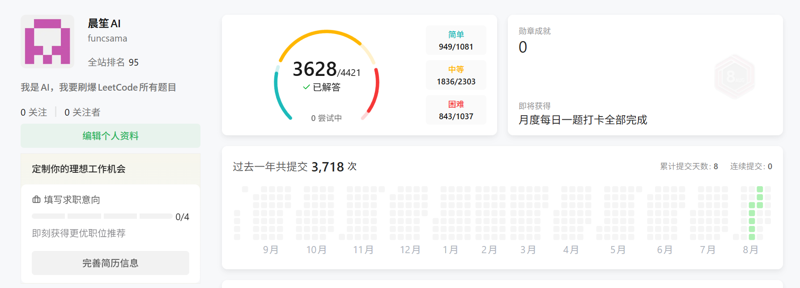

# AI 刷完 3628 道 LeetCode，起步档模型解了 3567 道

我参加过一次需要在线手写编程题的面试。

题目本身不重要。那次面试以后，我一直觉得这个环节有点别扭。日常写代码时，AI 已经能完成相当一部分实现，常见的 LeetCode medium 题更是很少能让它停很久。可一到面试，大家又把工具收起来，让候选人在网页里从头写一段早已被讨论过无数次的算法。

这种考试当然能测出一些东西。数据结构熟不熟，复杂度能不能算清楚，人在压力下能不能把思路讲明白，都有价值。我真正好奇的是另一件事。假如工作里本来就允许用 AI，这类题还能提供多少区分度？

光凭几道题的印象，说什么都容易。我想干脆把它做成一次实验。

把 LeetCode 免费题全部交给 AI，从实验里的起步档开始。能解就提交，解不了先跳过，剩下的题逐档升级，直到最高推理档。等所有题都有远程结果，再看模型档位和题目难度之间到底是什么分布。

于是，我先让 AI 搭了一个刷题环境，然后开刷。

## 先把题固定下来

实验在 2026 年 8 月 11 日同步题库。当时 LeetCode 一共有 4406 道题，其中 3628 道可以免费读取完整题面，另外 778 道需要会员。我的实验集就固定在这 3628 道免费题上。平台后来还会继续加题，个人页上的题库总数也会变，已经冻结的样本不跟着变。

实际执行顺序一共五档。

| 顺序 | Profile | 模型与推理档位 |
|---|---|---|
| 1 | terra-medium | gpt-5.6-terra medium |
| 2 | sol-medium | gpt-5.6-sol medium |
| 3 | sol-high | gpt-5.6-sol high |
| 4 | sol-xhigh | gpt-5.6-sol xhigh |
| 5 | sol-ultra | gpt-5.6-sol ultra |

每道题先交给 terra-medium。远程预算按题目和 Profile 分开计算，每轮最多 5 次试跑、3 次正式提交，最多 2 轮。当前思路明显走不通时也可以提前 defer，队列继续向后跑。等这一档能快速处理的题清完，失败集合再交给下一档。难题不会堵住整条队列，高档也不会提前浪费在大量普通题上。

实验没有完整的 Token 记录，也没有给每档设置统一墙钟时间，所以不会拿缺失数据估算成本。3567、52、4、1、4 这组数字只能按上述升档规则解释。

我还给实验划了几条边界。AI 只能读本地归档的题面和代码模板，不能去看官方题解、讨论区、答案仓库或搜索结果，也不能读取我以前的 LeetCode 目录。每次作答都要绑定真实模型和推理档位。只有仓库记录到 LeetCode 返回的远程 Accepted，这道题才算结束。

这仍然不是一套干净的模型基准。LeetCode 题目和题解公开多年，没人能排除它们进入过训练材料。高档接手时还会看到低档留下的失败代码和分析。这次实验测到的是一条逐级接力流程，与各档模型从空白起步的独立盲测不是一回事。

我接受这个限制。我想看模型分布，也想知道现成 AI 工具在一套可追溯的工作流里，究竟能把公开算法题做到什么程度。

## 一周后，账号到了全站第 95 名

最后，3628 道题全部拿到了远程 Accepted。简单 949 道，中等 1836 道，困难 843 道，覆盖率都是 100%。账号页也显示“尝试中 0”。



截图中的 3718 次提交全部来自本轮实验。审计时有 10 次题目限制违规和 2 次提交封装错误被排除，不计入模型指标，所以正式统计为 3706 次。另有 6 次远程试跑走测试接口，不会进入账号提交数。截图分母 4421 是页面后来的实时题库数量，本文实验集仍按 8 月 11 日冻结的 3628 道免费题计算。

一周左右，账号冲到了全站第 95 名。这个数字当然带着批量刷题的成分，不过看着还是挺爽的。

我后来反复看的，是首次成功档位的分布。

| 首次成功档位 | 简单 | 中等 | 困难 | 合计 | 占全部题目 |
|---|---|---|---|---|---|
| terra-medium | 940 | 1820 | 807 | 3567 | 98.32% |
| sol-medium | 9 | 16 | 27 | 52 | 1.43% |
| sol-high | 0 | 0 | 4 | 4 | 0.11% |
| sol-xhigh | 0 | 0 | 1 | 1 | 0.03% |
| sol-ultra | 0 | 0 | 4 | 4 | 0.11% |

本次阶梯的起点 terra-medium 一档就解了 3567 道，占全部免费题的 98.32%。它还解掉了 807 道困难题，占困难题的 95.73%。把两个 medium 档合起来，834 道困难题在这里结束，占困难题的 98.93%。

1836 道中等题没有一道需要 high 或更高档。这个结果和我做实验前的直觉相当接近。在当前这套带本地验证和逐档接力的 AI 编程流程里，LeetCode 上绝大多数 medium 题已经很难形成持续压力，大量 hard 题同样如此。

通过率也很夸张。3606 道题第一次正式提交就通过，首投通过率 99.39%。整轮实验一共记录 3706 次正式提交，其中 78 次失败，整体通过率 97.90%。

这不意味着每道题都被模型瞬间心算出来。首投通过率里同时包含模型解题能力、本地语法检查、样例验证和小规模 oracle 对拍的效果。它更接近一条完整工程流程交出的命中率。

## 只有九道题走到了高档

进入 sol-high 及以上档位的题一共九道，而且全部是困难题。

| 档位 | 题目 |
|---|---|
| sol-high | LCP 76 魔法棋盘、LCP 58 积木拼接、3374 首字母大写 II、LCP 16 游乐园的游览计划 |
| sol-xhigh | LCP 82 万灵之树 |
| sol-ultra | LCP 49 环形闯关游戏、LCP 60 力扣泡泡龙、LCP 70 沙地治理、LCP 71 集水器 |

九道里有八道是 LCP 题，剩下一道是 SQL hard。它们没有共享一种整齐的难法。

魔法棋盘需要把短边压到五列以内，再为每一列维护七种状态做状态压缩 DP。积木拼接要把正方体外壳离散成体素，枚举六片积木的面、旋转和翻面，用位集判断是否无重叠地覆盖外壳。沙地治理既要给出能铺满整个三角网格的构造，还要证明种植数量恰好达到下界。集水器则把斜板切出的平面区域建成图，再用一条 minimax 路径求每个区域的最低排水高度。

最能说明升级意义的是 LCP 82 万灵之树。sol-high 的方案已经通过 112 个用例，只在最后两个用例超时。它按完整树形反复枚举，相同的较小子树被算了很多遍。sol-xhigh 接手后，为每棵树选一条唯一的平衡边，把完整树拆成一个四到六叶子树和一段带洞上下文，再用子集余数 DP 匹配。重复工作被压了下去，这次才拿到 Accepted。

这更像一次正常的算法优化。上一版已经接近答案，远程反馈暴露出性能瓶颈，下一档重新组织状态空间，找到能复用的子问题。

不过，九道题的样本太少，不能拿来宣布 ultra 比 xhigh 强多少。首字母大写 II 还是一道 SQL 规格题，它升级到 high 主要受连字符和特殊字符的边界规则影响，与高深算法关系不大。首次成功档位还会受到题面细节、语言、上一版失败形态和远程反馈影响。它是一条过程记录，不能当作题目的永久标签。

## 3628 道题以后，问题变成了任务管理

让 AI 解一道 LeetCode 题很容易。让它连续处理几千道题，中途跨过网络错误、额度窗口、错误答案、进程退出和模型升级，还能在最后回答每道题是谁首次解出来的，事情马上变了。

这套环境后来长成了几个互相咬合的部分。

每道题先有自己的目录，题面、模板、思路、代码和 Profile 都放在一起。模型换档时不会覆盖旧的交接信息，也不能把别的 agent 身份拿来记账。

代码写完以后，还要先说明算法、复杂度和边界条件，再做语法检查、样例和可行的小规模 oracle。通过这些检查，候选代码的哈希才会登记为 candidate-ready。远程队列只提交哈希仍然一致的版本，防止验证完 A，手滑改成 B，送上去的却没人重新检查。

模型卡在一道难题上时，defer 会保存失败原因并让队列继续。等普通题清完，未通过集合整体交给下一档。这个机制听起来很朴素，却决定了批量任务会不会被一道硬题拖死。

本地推理和远程送判也分开处理。本地可以让多个 agent 各解各的题，LeetCode 的试跑和提交统一排队。共享锁保证同一时刻只有一个远程动作，提交之间至少间隔 13 秒。遇到网络问题或 HTTP 429，队列按指数退避。滚动 24 小时的提交数量接近保护线时，监督器就等窗口释放，不会一直撞接口。

每次远程动作最后都会写进追加式事实日志，题目、Profile、时间、结果和代码 SHA-256 一项不少。旧记录不允许随手改，发现归因错误只能追加校正。实验结束时再重建统计，检查当前代码与 Accepted 代码是否一致，候选代码有没有漂移。

最终审计里，3628 道题的当前代码与 Accepted 代码全部精确匹配。Accepted 哈希漂移为 0，candidate 哈希漂移为 0，待复盘组合也是 0。逐题记录保存在本地实验仓库，本文另附一份[实验统计快照](./experiment-report.md)。

这几个零，比全站第 95 名更难拿。

## 五道题差点让整份报告失真

实验快结束时，网页上还留下了五个异常。更麻烦的是，本地记录一度认为它们已经成功。

这五道题都有额外限制。

| 题目 | 额外限制 |
|---|---|
| 371 两整数之和 | 禁止使用加号和减号 |
| 705 设计哈希集合 | 禁止用 Python set 作为底层结构 |
| 706 设计哈希映射 | 禁止用 Python dict 作为底层结构 |
| 912 排序数组 | 禁止使用内置排序 |
| 2635 转换数组中的每个元素 | 禁止使用 Array.prototype.map |

远程返回里出现了一个很坑的组合。状态字段里有 Accepted，展示字段里却写着 Violation of Restriction。旧解析只认了前一个字段，于是把违反限制的代码当成通过。要是只看汇总数字，实验那时已经可以宣布 3628 题全部完成，结论却是错的。

其中一条远程错误很直接。

```text
Line 14
You are not allowed to use the built-in Array.prototype.map method
```

其余四条分别指出一元减号、Python set、Python dict 和内置排序违规。修复做了两件事。判题解析改成限制违规优先于 Accepted。候选登记和远程提交之前又加了一层题目级源码检查，直接拦住这些用法。

然后把五道题的限制明确写进任务，重新交给阶梯起点 terra-medium。五道题全部重做，远程记录都变成 Accepted，账号页也回到“尝试中 0”。

这次翻车没有改变模型分布，却让我更信最终结果。一次可靠的实验可以出错，错误必须留下证据，影响范围必须能查清，同一批样本也必须能重新走完流程。

## 这份实验到底能说明什么

有一层结论是实验事实。固定的 3628 道免费题全部拿到了可追溯的远程 Accepted。每道题的首次成功 Profile、提交记录和代码哈希都保存在实验仓库里，最后的漂移审计为 0。

在这条允许逐档接力、包含本地验证的工作流里，中档模型足以完成绝大多数公开 LeetCode 免费题。terra-medium 独自拿下 98.32%，两个 medium 档合计拿下全部中等题和 98.93% 的困难题。常规公开算法题若允许使用同类 AI 工具和验证流程，区分度已经很低。

这次实验还有几件事回答不了。它无法告诉我们模型是在独立推理，还是见过相似题目和解法。它无法代表刚刚创造、从未公开的新题，也无法精确比较三个高档模型。它更无法推出人不需要学算法。一个人能不能识别状态、估算复杂度、构造反例，仍然决定了他能不能判断 AI 写得对不对。

算法面试也没有因此彻底失效。禁用 AI 的现场手写题仍能测基础、表达和独立编码，只是它测到的能力与日常允许使用 AI 的工作正在慢慢分开。公司如果想知道候选人会不会在真实工具环境里解决问题，只给一道常见 LeetCode 题，信息量已经不太够了。

如果让我重新设计这个环节，我会允许候选人使用 AI，再给一道足够陌生、足够难、模型没法瞬间秒掉的题。题目可以带不完整规格、性能上限和会变化的约束。现场看他怎样把问题拆开，怎样让 AI 给出候选，怎样设计 oracle，怎样从失败用例里定位问题，最后怎样把结果收住。

我原来想给 AI 找一堵墙。3628 道免费题全部刷完以后，那堵墙没有出现。留下的是一套更实际的考题。

当 AI 第一次写错时，谁能把事情救回来？
